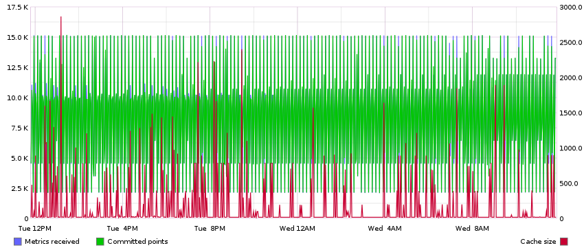

===================================
Debugging "gaps in graphs" syndrome
===================================

This document discusses various causes of missing Graphite data, AKA gappy
graphs AKA holy graphs (or even completely blank graphs). You should verify
each issue in the order they are listed.

Problems at the Graphite end of things
======================================

.. _graph_gaps_storage_schema:

Whisper files have the wrong storage schema
-------------------------------------------

If you forgot to copy NAV's suggested rules for :program:`carbon-cache`'s
:file:`storage-schemas.conf` configuration file, you will have problems. Same
goes if a NAV upgrade included new rules you forgot to add.

The Whisper round robin database format expects data points to come in at the
same rate as specified in its first retention archive (the highest resolution
archive). The typical default values from :file:`storage-schemas.conf` will
create Whisper files with their highest resolution archive set to 1 minute
intervals. Traffic data from NAV is collected in 5 minute intervals, which
means only every fifth data point would be populated in this scenario. That's
not nearly often enough to draw a continuous line between data points.

The :program:`whisper-info` (or :file:`whisper-info.py`) can be used to
inspect individual ``.wsp`` files to see what resolution their first retention
archive is configured with (this is the ``secondsPerPoint`` value of archive
number 0). If this isn't 300 seconds (5 minutes) for any
``.wsp`` file located under the :file:`ports/` directory of a device, then you
know these have been created with the wrong schema.

There are two ways to resolve this. *Both begin with adopting the proper
storage schema rules from NAV's suggested config*. Following that, you can
either:

1. Delete all the existing ``.wsp`` files that have the wrong schema. **You will
   lose data.**
2. Use the :program:`whisper-resize` (or :file:`whisper-resize.py`) program to
   resize individual ``.wsp`` files, by specifying the correct schema (as per.
   NAV's suggested schema rules).

UDP packets are being dropped
-----------------------------

Because NAV sends data to Carbon using UDP, there is no guaranteed data
reception. This could be solved by using TCP, but with a considerable
performance penalty. As data collection in NAV is very bursty, it has occurred
that the kernel's UDP receive buffer has overflowed, causing the kernel to
drop packets. This leads to gaps in the graphs.

Verify packet drops
~~~~~~~~~~~~~~~~~~~

On Linux, to verify that packets are being dropped, you can look in the
:file:`/proc/net/udp` file and find the line with the local port the Carbon
daemon is listening to (default port **2003**, or **07D3** in hex). The number
of packets dropped since the daemon started is shown in the last column. To
output only this number, use:

.. code-block:: console

  $ awk '$2~/07D3/{print $NF}' /proc/net/udp
  4031

If this number keeps increasing, you are affected by the packet dropping
issue.

Increasing the UDP receive buffer
~~~~~~~~~~~~~~~~~~~~~~~~~~~~~~~~~

If packets are being dropped, you can try to increase the kernel's network
receive buffer to avoid this. On Linux this can be done with the following
commands:

.. code-block:: sh

  sysctl net.core.rmem_max                  # See current setting
  sysctl -w net.core.rmem_max=16777216      # Set max buffer to 16MB
  sysctl -w net.core.rmem_default=16777216  # Set default buffer to 16MB

Experiment with different values until the packet dropping stops. You need to
restart the carbon daemon (``carbon-cache`` or ``carbon-relay``, depending on
your setup) to make the changes take effect.

Carbon's cache is saturated
---------------------------

If the `carbon-cache` daemon (or daemons, if you have configured multiple) is
unable to write data to your storage medium at a fast enough rate, its
internal cache will be saturated, and it will start to drop incoming metrics.
This will typically happen if the volume and rate of incoming metrics is
larger than your I/O subsystem can support writing.

Use this NAV/Graphite URL to render a graph that can give some insight into
what's going on inside your `carbon-cache`::

    /graphite/render/?width=852&height=364&from=-1day&target=alias%28sumSeries%28group%28carbon.agents.%2A.metricsReceived%29%29%2C%22Metrics+received%22%29&target=alias%28sumSeries%28group%28carbon.agents.%2A.committedPoints%29%29%2C%22Committed+points%22%29&target=alias%28secondYAxis%28sumSeries%28group%28carbon.agents.%2A.cache.size%29%29%29%2C%22Cache+size%22%29

This graph shows the relationship between incoming data points, and datapoints
committed to disk, while superimposing the size of the internal cache on top.
You should be able to quickly identify any capacity issues here: The rate if
incoming data points is continuously higher than the rate of committed points,
and the cache size is ever-increasing (until it at some points hits the max
cache size, configured in :file:`carbon.conf`).

A healthy graph may look something like this (where the rate of incoming and
committed points are roughly equal, and increases in cache size are only
temporary):

You could add this graph to your NAV dashboard to monitor it continuously.

The only way around this is to scale up your Graphite infrastructure. You can
add faster drives (solid state drives aren't a bad idea), or set up a cluster
of multiple Graphite servers. Please consult `Graphite's own documentation`_
(or Google) on how to accomplish this.

.. _`Graphite's own documentation`: http://graphite.readthedocs.io/en/latest/config-local-settings.html#cluster-configuration

As an alternative to this, you could consider whether you need to collect
traffic statics from every access port in your network. If you change the
category of an access switch from ``SW`` to ``EDGE`` in SeedDB, NAV will
effectively stop collecting traffic counters from its interfaces.

Problems at the NAV end of things
=================================

.. note::

   Unless you have been changing the job configurations of
   :program:`ipdevpoll` considerably, there are two main jobs that collect
   statistics using SNMP: ``1minstats`` and ``5minstats`` - the former running
   on a 1 minute interval, the latter on 5 minute intervals. The `1minstats`
   job primarily collects all system stats and sensor values, whereas the
   `5minstats` job typically collects interface counters.

ipdevpoll stats jobs are failing
--------------------------------

If any of ipdevpoll's metric collection jobs are failing for a device, the
metrics collected by that job may either have incomplete or missing data,
depending on how/when the jobs are failing. There are several ways to check
how the jobs are doing for one or more devices:

1. Go to the device's IP Device Info page (e.g. search for the device name in
   the nav bar at the top of every NAV web page). Check the job status
   listings (at the lower right of the page). If the `5minstats` or
   `1minstats` job are marked as red, the last time this job was run, it
   failed. If the jobs are marked yellow, they have not been run or completed
   within the expected time interval.

2. Grep the logs for errors (for any device)::

     grep 'ERROR.*minstats' /var/log/nav/ipdevpoll.log

3. Open the Watchdog tool from the Toolbox menu. Any ipdevpoll jobs that are
   repeatedly failing will show as errors here.

Stats jobs failing due to timeout errors
~~~~~~~~~~~~~~~~~~~~~~~~~~~~~~~~~~~~~~~~

Do the devices that are timing out have any common factors? Same model,
vendor, software?

Some devices are particularly slow to respond to SNMP requests at large, while
some are slow to respond to particular SNMP requests - in particular, we often
see agents that are slow to build large responses to ``GET-BULK`` requests,
which NAV always uses in a SNMP *v2c* session.

You can try to alleviate the timeout problems by increasing ipdevpoll's SNMP
request timeout, alternatively in conjunction with reducing the
``max-repetitions`` value (which is the maximum number of consecutive values
ipdevpoll asks an agent to return in a single SNMP response packet when
employing `GET-BULK`_ requests).

ipdevpoll stats jobs aren't running at the correct interval
-----------------------------------------------------------

The Whisper round robin database format expects data points to come in at the
same rate as specified in its first retention archive. If ipdevpoll does not
send metrics to carbon at the rate expected for the given metric's schema,
gaps may occur in the data.

If the device ``example-gw`` is missing data in its port counter metrics, you
can attempt to verify that the `5minstats` job for ``example-gw`` is actually
running on the configured 5 minute interval by grepping the logs and checking
the timestamps of job completion (when you have already confirmed the jobs
themselves aren't failing):

.. code-block:: console

    # grep 'INFO.*5minstats example-gw.*completed' /var/log/nav/ipdevpoll.log
    2017-11-10 13:46:21,400 [INFO schedule.netboxjobscheduler] [5minstats example-gw.example.org] 5minstats for example-gw.example.org completed in 0:00:06.151333. next run in 0:04:53.848691.
    2017-11-10 13:51:21,510 [INFO schedule.netboxjobscheduler] [5minstats example-gw.example.org] 5minstats for example-gw.example.org completed in 0:00:06.259981. next run in 0:04:53.740050.
    2017-11-10 13:56:21,293 [INFO schedule.netboxjobscheduler] [5minstats example-gw.example.org] 5minstats for example-gw.example.org completed in 0:00:06.042444. next run in 0:04:53.957581.
    2017-11-10 14:01:21,747 [INFO schedule.netboxjobscheduler] [5minstats example-gw.example.org] 5minstats for example-gw.example.org completed in 0:00:06.476202. next run in 0:04:53.523833.

This example shows that the `5minstats` is consistently running on 5 minute intervals.

Once you cross a certain threshold, depending on your hardware setup and the
number of nodes/ports you are monitoring with NAV, you may find that ipdevpoll
is having issues scheduling its jobs in a timely fashion: There's too much
work, and too little resources to complete it on time.

This is when you should start experimenting with ipdevpoll's
:ref:`multiprocess mode <ipdevpoll-multiprocess>`.

.. _`GET-BULK`: https://tools.ietf.org/html/rfc1448#section-4.2.3
