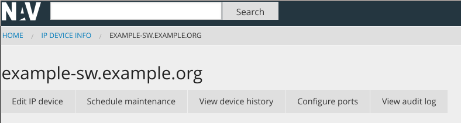

===============================================
 How to customize parts of NAV's web interface
===============================================

Some users like to modify parts of the NAV web interface to add their own
information from, or links to, third party systems. In doing so, they override
some of NAV's existing Django templates. *This is an unhealthy practice*, as it
may cause errors or missing functionality the next time they upgrade NAV and
the forked template changes.

This guide serves to document the various official hooks into the NAV web
interface. It is assumed you have a working knowledge of the `Django templating
system <https://docs.djangoproject.com/en/4.2/topics/templates/>`_.

How to add custom templates
===========================

NAV's Django templates are located inside its Python module directories. *You
should not be modifying these directly*. If you need to override existing
templates, or add custom hook templates, you should do so in a location that
Django will search for templates *before* it looks into NAV's internal template
directories.

There are two ways to do this:

1. The simple way: NAV includes a :file:`templates/` directory, relative to its
   config directory, in its template search patch. If your NAV config is
   located in :file:`/etc/nav/`, you can create the directory
   :file:`/etc/nav/templates/` and have Django find your custom templates
   there.

2. The "proper" way: You write your own Django application and include into
   NAV's site configuration by way of a
   :file:`/etc/nav/python/local_settings.py` file. Just include templates in
   your app as you normally would in any Django app.

Hooks
=====

Adding custom tabs to ipdevinfo
-------------------------------

*ipdevinfo* is the tabbed interface that displays NAV's information about
single IP devices.

The tabbing system HTML is built around using unordered list elements
(``ul/li``) as tab headers, with hyperlinks to anchor tags. The content of each
tab is a ``div`` with an id that matches those anchor tags.

ipdevinfo tries to include the custom template ``ipdevinfo/custom-tabs.html``
to add extra tab header elements, and ``ipdevinfo/custom-fragments.html`` to
include the ``div`` elements with their corresponding contents.

A simple customization example
~~~~~~~~~~~~~~~~~~~~~~~~~~~~~~

.. code-block:: html+django
   :caption: ipdevinfo/custom-tabs.html

   <li><a href="#foobar">Foobar</a></li>
   <li><a href="#frobnicate">Frobnication</a></li>

.. code-block:: html+django
   :caption: ipdevinfo/custom-fragments.html

   

       <h2>This is a custom tab for {{ netbox }}</h2>
       
It's got stuff in it.

   

   

       <h2>Frobnication data for {{ netbox }}</h2>
       
A perfectly cromulent tab.

   

Adding custom buttons to ipdevinfo
----------------------------------

On the device details page, there is a row of action buttons, just above the
information tabs:

You can add custom content (more buttons) to this row by creating a
``ipdevinfo/custom-header-button-extras.html`` template. Here's a simple
example, adding a button that takes the user to a a third party web page:

.. code-block:: html+django
   :caption: ipdevinfo/custom-header-button-extras.html

   <li>
       <a href="https://cmdb.example.org/device/{{ netbox.sysname }}"
          class="button small secondary">
           Lookup device in company CMDB
       </a>
   </li>

Adding custom information to the ipdevinfo "What if" tab
--------------------------------------------------------

The IP Device Info tab titled :guilabel:`"What if"`, shows a summary of other
devices, organizations and users that may be affected if the viewed device goes
down. The tab also provides functionality to send e-mail to the contact
addresses of the affected organizations (if contacts have been added).

A custom template named ``ipdevinfo/custom-affected.html`` can be used to
insert information at the bottom of this tab:

.. code-block:: html+django
   :caption: ipdevinfo/custom-affects.html

   <section>
       <h4>Information from foobar</h4>
       <a href="https://foobar.example.org/device/{{ netbox.sysname }}"
          class="button small secondary">
           Lookup affected links in Foobar
       </a>
   </section>

Adding custom information to the port details tab
-------------------------------------------------

On the page displaying details about a port, a custom template named
``ipdevinfo/custom-port-tabs.html`` can be used to add additional
custom tabs. These tabs can be used to display additional information
about the port, using data from a Network Inventory System for
example.

Adding custom tabs to the room overview page
--------------------------------------------

The *info* subsystem is the part of NAV that displays information about other
NAV objects, such as VLANs, rooms, locations and so on. The room information
page is also tabbed, but its tabs are more dynamic in nature than ipdevinfo's.

As with ipdevinfo, the tabbing system HTML is built around using unordered list
elements (``ul/li``) as tab headers, with hyperlinks to *other URLs that will
provide the content of the tab* dynamically as the tab is selected. This
functionality is provided by *jQuery UI*.

Each list element must reference a placeholder ``div`` using the
``aria-controls`` element attribute, as shown in the example below.

The room page tries to include the custom template
``info/room/custom-tabs.html`` to add extra tab header elements, and
``info/room/custom-fragments.html`` to include the ``div`` elements that will
be placeholders for the dynamically fetched content.

A simple customization example
~~~~~~~~~~~~~~~~~~~~~~~~~~~~~~

.. code-block:: html+django
   :caption: info/room/custom-tabs.html

   <li aria-controls="foobar">
       <a href="http://example.org/my-exciting-html-snippet-generating-url">Foobar</a>
   </li>

.. code-block:: html+django
   :caption: info/room/custom-fragments.html

   

