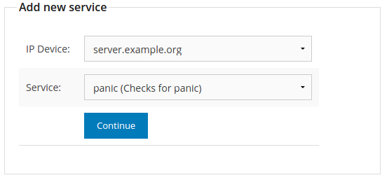
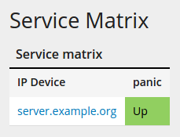
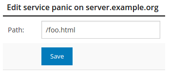

===============================
Writing a new servicemon plugin
===============================

This guide will document an example of how to implement a new service monitor
plugin in NAV.

A quick intro to the service monitor
====================================

The NAV service monitor is part of the legacy *statemon* system. NAV
development has not put much effort in service monitoring, though, focusing
instead on the core functionality of network hardware monitoring. The service
monitoring system therefore has its limitations.

The basic limitations are as follows:

- A service must be associated with an IP device (e.g. a server).
- A service must necessarily be hosted on the single management IP address of
  the server. Multi-homed servers are not supported (although you can
  potentially hack this by adding an IP address as an argument to your
  plugin).

The goal
========

Write a service monitor plugin that verifies the presence of the phrase "Don't
Panic" in a web page.

Writing the plugin
==================

The basics
----------
A servicemon plugin is called a **checker**.

Requirements:

- The **checker** must be a Python class inheriting from
  :py:class:`nav.statemon.abstractchecker.AbstractChecker`.
- The class name must be suffixed with the string ``Checker``.
- The class must be contained within a module that has an identical name.
- The module must reside in the :py:mod:`nav.statemon.checker` package.

Writing a simple checker skeleton
---------------------------------
We begin with something like this, in the file
:file:`nav/statemon/checker/PanicChecker.py`:

.. code-block:: python
   :linenos:

   from nav.statemon.event import Event
   from nav.statemon.abstractchecker import AbstractChecker

   class PanicChecker(AbstractChecker):
       IPV6_SUPPORT = True
       DESCRIPTION = "Checks for panic"

       def execute(self):
           return Event.UP, "Everything is fine"

You can now open *SeedDB* in your browser, go to :menuselection:`Service -->
Add new service` and add this new service checker to some server.

Shortly thereafter, you should see this in the logs (:file:`servicemon.log`)::

  [2015-09-02 10:22:14] abstractchecker.py:run:107 [Info] server.example.org:panic -> Everything is fine

And the service matrix status should be green:

.. note:: Another one of the limitations of the service monitor system, is
          that the status of a service will be shown as green even if the
          service checker doesn't run. It will only flag an alert if the
          service checker actually runs and reports a failure.

Congratulations, you have just recreated the
:py:mod:`nav.statemon.checker.DummyChecker` - a checker that accepts no
arguments and always reports a positive result.

Fleshing out the plugin
-----------------------

Now let's make the plugin do something useful. Instead of replicating the
convoluted :py:mod:`nav.statemon.checker.HttpChecker`, we use the Python
Requests library to fetch the web page and examine its contents:

.. code-block:: python
   :linenos:
   :emphasize-lines: 11, 12

   import requests
   from nav.statemon.event import Event
   from nav.statemon.abstractchecker import AbstractChecker

   class PanicChecker(AbstractChecker):
       IPV6_SUPPORT = True
       DESCRIPTION = "Checks for panic"

       def execute(self):
           ip, port = self.get_address()
           url = 'http://%s/' % ip
           req = requests.get(url)
           if req.status_code == 200:
               if "don't panic!" in req.text.lower():
                   return Event.UP, "No panic is needed"
               else:
                   return Event.DOWN, "Panicking!"
           else:
               return Event.DOWN, "%s status code = %s" % (url, req.status_code)

As you can see from lines 12 and 13, we get the server's IP address using the
inherited :py:func:`get_address()` function, and build an HTTP URL from that.

.. note:: Servicemon does not reload changed plugins, so you will need to
          restart the daemon for this change to take effect.

Given that ``server.example.org`` is not currently running a web server, you
should now get logs that look like this::

[2015-09-02 10:52:58] abstractchecker.py:run:107 [Info] server.example.org:panic -> ('Connection aborted.', error(111, 'Connection refused'))
[2015-09-02 10:52:58] abstractchecker.py:run:124 [Notice] server.example.org:panic -> State changed. New check in 5 sec. (DOWN, ('Connection aborted.', error(111, 'Connection refused')))
[2015-09-02 10:53:03] abstractchecker.py:run:107 [Info] server.example.org:panic -> ('Connection aborted.', error(111, 'Connection refused'))
[2015-09-02 10:53:03] abstractchecker.py:run:124 [Notice] server.example.org:panic -> State changed. New check in 5 sec. (DOWN, ('Connection aborted.', error(111, 'Connection refused')))
[2015-09-02 10:53:08] abstractchecker.py:run:107 [Info] server.example.org:panic -> ('Connection aborted.', error(111, 'Connection refused'))
[2015-09-02 10:53:08] abstractchecker.py:run:124 [Notice] server.example.org:panic -> State changed. New check in 5 sec. (DOWN, ('Connection aborted.', error(111, 'Connection refused')))
[2015-09-02 10:53:13] abstractchecker.py:run:107 [Info] server.example.org:panic -> ('Connection aborted.', error(111, 'Connection refused'))
[2015-09-02 10:53:13] abstractchecker.py:run:133 [Alert ] server.example.org:panic -> DOWN, ('Connection aborted.', error(111, 'Connection refused'))

This tells you a couple of things:

- If an exception is raised inside the :py:func:`execute()` method, this is
  automatically considered a service failure by servicemon.
- When your service checker reports a changed state, servicemon will retry it
  three times before posting an event to NAV's event queue.

With a web server active at ``server.example.org``, you might get this instead::

  [2015-09-02 11:08:18] abstractchecker.py:run:107 [Info] server.example.org:panic -> Panicking!
  [2015-09-02 11:08:18] abstractchecker.py:run:124 [Notice] server.example.org:panic -> State changed. New check in 5 sec. (DOWN, Panicking!)
  [2015-09-02 11:08:23] abstractchecker.py:run:107 [Info] server.example.org:panic -> Panicking!
  [2015-09-02 11:08:23] abstractchecker.py:run:124 [Notice] server.example.org:panic -> State changed. New check in 5 sec. (DOWN, Panicking!)
  [2015-09-02 11:08:28] abstractchecker.py:run:107 [Info] server.example.org:panic -> Panicking!
  [2015-09-02 11:08:28] abstractchecker.py:run:124 [Notice] server.example.org:panic -> State changed. New check in 5 sec. (DOWN, Panicking!)
  [2015-09-02 11:08:34] abstractchecker.py:run:107 [Info] server.example.org:panic -> Panicking!
  [2015-09-02 11:08:34] abstractchecker.py:run:133 [Alert ] server.example.org:panic -> DOWN, Panicking!

At this point, add the string "Don't Panic!" to the document served at ``/``
on your web server. You should soon see this in the logs::

  [2015-09-02 11:12:23] abstractchecker.py:run:107 [Info] server.example.org:panic -> No panic is needed
  [2015-09-02 11:12:23] abstractchecker.py:run:124 [Notice] server.example.org:panic -> State changed. New check in 5 sec. (UP, No panic is needed)
  [2015-09-02 11:12:28] abstractchecker.py:run:107 [Info] server.example.org:panic -> No panic is needed
  [2015-09-02 11:12:28] abstractchecker.py:run:124 [Notice] server.example.org:panic -> State changed. New check in 5 sec. (UP, No panic is needed)
  [2015-09-02 11:12:33] abstractchecker.py:run:107 [Info] server.example.org:panic -> No panic is needed
  [2015-09-02 11:12:33] abstractchecker.py:run:124 [Notice] server.example.org:panic -> State changed. New check in 5 sec. (UP, No panic is needed)
  [2015-09-02 11:12:38] abstractchecker.py:run:107 [Info] server.example.org:panic -> No panic is needed
  [2015-09-02 11:12:38] abstractchecker.py:run:133 [Alert ] server.example.org:panic -> UP, No panic is needed

Summary so far
--------------

What have we learned so far?

- A plugin must inherit from
  :py:class:`nav.statemon.abstractchecker.AbstractChecker`.
- The plugin must implement the :py:func:`execute()` method, where all the
  work is done.
- The :py:func:`execute()` method must return its status as a two-element
  tuple. The first element must either be ``Event.UP`` or ``Event.DOWN``,
  while the second element must be a human-readable description of the status
  (which will be attached to any events posted).
- The plugin can describe itself to the outside world by setting the class
  variables ``IPV6_SUPPORT`` and ``DESCRIPTION``.

Adding arguments
----------------

To make your plugin more configurable, it should accept arguments. Your plugin
class can specify mandatory arguments in the ``ARGS`` class variable, while
optional arguments can be specified in the ``OPTARGS`` class variable. Each of
these must be a list of two-tuples, each two-tuple consisting of an argument
name and argument description.

Any arguments provided when configuring the service checker in SeedDB will be
placed in a Python dictionary in the plugin's ``args`` instance variable.

Let's make the document path configurable in our plugin:

.. code-block:: python
   :linenos:
   :emphasize-lines: 15

   import requests
   from nav.statemon.event import Event
   from nav.statemon.abstractchecker import AbstractChecker

   class PanicChecker(AbstractChecker):
       IPV6_SUPPORT = True
       DESCRIPTION = "Checks for panic"
       OPTARGS = (
           ('path', 'Document path to fetch'),
       )

       def execute(self):
           ip, port = self.get_address()
           path = self.args.get('path', '/')
           url = 'http://%s%s' % (ip, path)
           req = requests.get(url)
           if req.status_code == 200:
               if "don't panic!" in req.text.lower():
                   return Event.UP, "No panic is needed"
               else:
                   return Event.DOWN, "Panicking!"
           else:
               return Event.DOWN, "%s status code = %s" % (url, req.status_code)

Now, restart servicemon and add a path argument of ``/foo.html`` to the
service instance, using SeedDB:

Assuming there is no ``/foo.html`` document on your web server, this should be
seen in the logs::

  [2015-09-02 11:13:49] abstractchecker.py:run:107 [Info] server.example.org:panic -> http://10.0.1.42/foo.html status code = 404
  [2015-09-02 11:13:49] abstractchecker.py:run:124 [Notice] server.example.org:panic -> State changed. New check in 5 sec. (DOWN, http://10.0.1.42/foo.html status code = 404)

And if you then add a ``foo.html``, containing the phrase *Don't Panic!*, you
should be good to go again.

In conclusion
=============

Now you should know what you need to write new plugins for the service
monitor. There is also a wealth of pre-existing checkers whose code you can
use for inspiration. Good luck!
