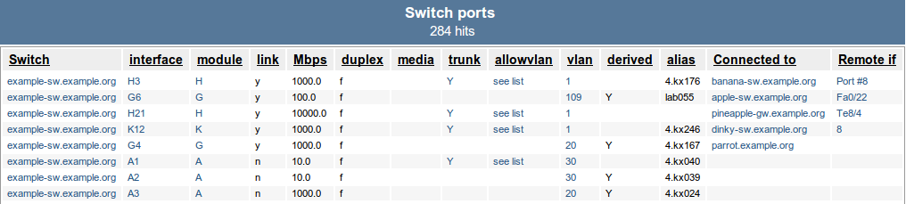

##########################################
 Troubleshooting topology problems in NAV
##########################################

After completing this how-to, you should be able to track down the causes of
physical topology detection problems in NAV, either solving them or collecting
the necessary information to report a problem to the developers.

.. WARNING:: This how-to isn't an exhaustive guide, but covers some of the
             most commonly experienced issues.

********
Overview
********

NAV provides several layers of topology information:

* The physical topology of your network (often referred to as layer 2 topology
  in NAV, since the topology information comes from what is visible from an
  OSI layer 2 standpoint - see Ethernet, or *IEEE 802.1D*).

* The VLAN topology of your network. These are the virtual sub-topologies of
  your physical network topology, as implemented through *IEEE 802.1Q*.

* Your IP (or layer 3) topology. This is simply derived from the IP addresses
  and subnet prefixes configured on the interfaces of your routers and
  switches.

*****************
Physical topology
*****************

Two connected devices aren't seen as connected by NAV
=====================================================

The most common issue reported to the NAV developers is that two devices that
should be connected in the *Netmap* are not.

.. NOTE:: Do not blame Netmap. Not without investigating further.

In such a case, you must first ascertain whether the problem is in Netmap
itself, or in the NAV database. It is only a problem with Netmap if what it
draws is not consistent with NAV data.

1. Search for one of the two devices in the NAVbar and click on it to open its
   information page.
2. Click on the :guilabel:`Ports` tab to see the port listing for this device.
3. In the two rightmost columns of this report, the detected neighbor and it's
   connected port (if detected) is listed.
4. You can click the :guilabel:`To Device` column twice to sort the ports beginning
   with the ones that NAV has detected a neighboring device on.

You should see something that looks like this:

As you can see, this device is connected to `palin-sw`, `idle-gsw`,
`gilliam-sw`, `cleese-sw` and `chapman-sw`. If there are devices you expect to be
listed as neighbors here that are not, your problem is **not** with *Netmap*.

Looking for the missing link
----------------------------

First, make sure the missing device is actually being monitored by your NAV
installation. Did you remember to add it using `SeedDB`? If not, add it, and
give the topology detector up to an hour to analyze the new information (or
you can run it manually, but more on that later). If your device is monitored
by NAV, please continue reading.

Before asking questions, you should now dig up at least some debugging
information to provide with your questions. You must get the list of neighbor
candidates that NAV considered for the involved ports.

Let's say that you know for a fact that ``parrot-sw``'s port *26* is connected
to ``cleese-sw``'s port *Gi2/1*. Do the following:

1. Browse ``parrot-sw`` in ipdevinfo, click on the :guilabel:`Ports` tab, then
   click on port :guilabel:`26` to see the details of it.
2. Under the :guilabel:`Connection` table, in the row titled :guilabel:`To IP
   device` there should be a small, clickable icon to browse the *Neighbor
   candidates* report for port 26. Click on it:

   .. image:: link-to-neighbor-candidates.png

   You might then see something like this:

   .. image:: neighbor-candidates.png

3. Do the same for the *Gi2/1* interface on ``cleese-sw``.
4. Attach the results of the two report listings when posting a question to a
   developer.

How NAV builds physical topology information
============================================

The collection stage
--------------------

NAV uses several sources of information to detect your physical topology, all
collected from SNMP queries against your monitored devices:

1. The ARP and ND caches of your routers.
2. The forwarding tables of your switches (CAM tables).
3. LLDP (Link Layer Discovery Protocol, *IEEE 802.1AB*)
4. CDP (Cisco Discovery Protocol)

The first of these is collected by the `ipdevpoll` `ip2mac` job in half-hour
intervals, whereas the last three are all collected by the `ipdevpoll` `topo`
job in 15-minute intervals.

These pieces of information are used to build lists of direct (or next-hop)
neighbor candidates for each of the ports in your monitored network.

Whereas protocols like CDP and LLDP, if supported and enabled, can usually
provide a pretty precise indication of what a port's next-hop neighbor is, NAV
can usually also detect topology without them.

.. NOTE:: Also, proprietary protocols, such as CDP, can also be imprecise in
          heterogeneous networking environments, as CDP packets will be
          invisible to any man-in-the-middle switch that doesn't support the
          protocol.

NAV knows the management IP address of all your monitored devices, and uses
ARP/ND data as a means of discovering the Ethernet MAC addresses associated
with these (Ethernet addresses of individual ports are also collected on
SNMP-enabled devices). Coupled with forwarding tables from your switches, NAV
can generate a list of next-hop neighbor candidates for each switch port.

When these collection jobs have run, each uplink/downlink port in your network
should have a list of possible next-hop neighbors and which protocol provided
each of them.

The analysis stage
------------------

The `navtopology` program runs as a cron job once every hour, analyzing the
neighbor candidate lists collected by `ipdevpoll`. It prefers LLDP information
over CDP and CAM information, but will otherwise use a very generic algorithm
for discerning which of the candidates are true next-hop neighbors.

In a case where you have made changes to which devices are monitored by NAV,
you can run the command manually, once `ipdevpoll` has finished it's `topo`
job for any new devices. The command :code:`navtopology --l2` will run a
physical topology analysis, and should be pretty quick.
