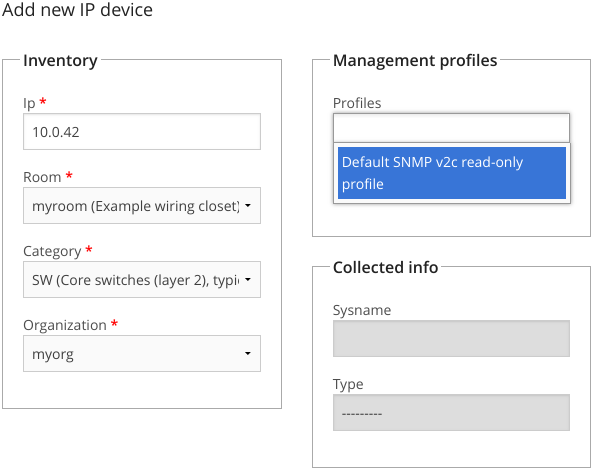
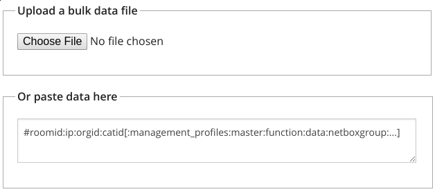

==========================
 Getting started with NAV
==========================

This tutorial will show you how to start monitoring devices with your brand
new NAV installation.

The tutorial will refer to the web interface as |URL| - replace
this with whatever hostname you have configured for your NAV server.

Minimal configuration
=====================

If installing from source, you should have installed a copy of the default set
of NAV configuration files to a global directory, typically :file:`/etc/nav/`,
:ref:`as documented in the installation guide
<initializing-the-configuration-files>`.

Most of the configuration files are documented with comments, so if you want to
get advanced you can check each config file to see if there are any defaults
you'd like to change.

We recommend you **at least** change the following options in :file:`nav.conf`
before running NAV:

`ADMIN_MAIL`
  Should be set to the NAV administrator's e-mail address.  Any cron
  mail or other administrative e-mails from NAV will be sent to this
  address.

`SECRET_KEY`
  A string of random characters that should be unique to each NAV
  installation. This is used by the Django framework for cryptographic signing
  in various situations. Here are three suggestions for generating a suitable
  string of random characters, depending on what tools you have available:

    1. :kbd:`gpg -a --gen-random 1 51`
    2. :kbd:`makepasswd --chars 51`
    3. :kbd:`pwgen -s 51 1`

  Please see
  https://docs.djangoproject.com/en/1.7/ref/settings/#std:setting-SECRET_KEY
  if you want to know more about this.

`TIME_ZONE`
  NAV's default time zone setting is ``Europe/Oslo``. You should set this to
  the appropriate timezone of your location, as NAV will use this for
  generating and displaying all timestamps. Beware that this *should* match the
  configured timezones of your PostgreSQL and Graphite-web installations as
  well.
  
`DOMAIN_SUFFIX`
  The DNS domain name your devices are in.  Many parts of the web
  interface will chop off this suffix to display abbreviated device
  names.

If you installed from source, and did not use a pre-packaged version of NAV,
you will also want to change the directory paths used by NAV to store various
state files, log files and files uploaded through the web interface:
``PID_DIR``, ``LOG_DIR`` and ``UPLOAD_DIR``.

  

Starting NAV
============

NAV has two parts; one web frontend, and a backend consisting of
multiple processes.  While Apache serves the frontend, the backend
processes can be controlled using the :program:`nav` command.

The backend processes consist of some daemon processes, and some cron jobs.
Running :kbd:`nav start` will start all the daemon processes in the
background, and install all the cron jobs in the `navcron` user's crontab.

Depending on your OS of choice, you should configure it to run :kbd:`nav
start` on boot.

Logging in to the web interface
===============================

When browsing the web interface at |URL| you will see the front page of NAV.
This is openly accessible to anonymous users by default.

To log in for the first time, click the `Login` link on the upper right of the
page, and enter the username "admin" and the default password "admin".  Then
click the `Userinfo` link in the grey navigation bar and change the
adminstrator's password to something more sensible.

Seeding your database
=====================

NAV will *not* autodiscover the routers and switches of your network.  You
need to use the `SeedDB` tool to enter IP addresses to monitor.  The `SeedDB`
tool is listed on NAV's `Toolbox` page, reachable from the grey navigation
bar.

Adding your first device to NAV
-------------------------------

The `SeedDB` tool enables to you add and edit a multitude of information in
the NAV database, but the essential bit here is the :term:`IP Device`.  Begin,
for example, by adding one of your switches:

1. Click the :guilabel:`IP device` tab and then the sub-tab :guilabel:`Add new
   IP device`
2. Fill out your switch's IP address in the :guilabel:`IP` field, and, for now,
   select :guilabel:`myroom` and :guilabel:`myorg` in the room and organization
   drop-downs.
3. Select :guilabel:`SW` in the category dropdown.  Don't worry, we'll explain
   the categories later.
4. Put your switch's SNMP community in the :guilabel:`Read only` field and click
   the :guilabel:`Check connectivity` button.

NAV will now check if this IP address responds to SNMP (v2c or v1) queries using
the entered community and, if possible, detect the device's type (from its
`sysObjectID` value).  NAV does not require that the connectivity test is
successful, or even that the test is run, to add the device. But if the test
fails this means that NAV can not communicate with the device. If that happens
you should verify that the information in the :guilabel:`IP` and :guilabel:`Read
only` fields is correct.

If you want you can add some free form text about the function of the device in
the function field, put the device into one or more relevant groups and even
assign custom attributes to it. These attributes will be used when NAV presents
information about the device.

Click on :guilabel:`Save IP device` to finalize your entry of this device into
NAV's database.

Verifying that collection is working
------------------------------------

Within two minutes, NAV's :doc:`SNMP collection engine </reference/ipdevpoll>` should launch a job to poll
your newly added device for information. The grey navigation bar features a
search field; search for your newly entered device's IP address or DNS name to
show its `IP Device Info` page. The resulting page should look something like
this:

.. image:: ipdevinfo-switch-display.png
   :scale: 50%

The `IP Device Info` page will try to display every bit of pertinent
information about a monitored device.  For now, the key information here is
the `Last updated` field of the top-left detail panel.  Keep reloading the
page until its value changes from `N/A` into a meaningful timestamp.

.. NOTE:: If no new information appears on this page within three minutes
          after adding your switch to NAV, you may need to start
          troubleshooting NAV's log files.

.. _selecting-a-device-category:

Selecting a device category
---------------------------

When adding an IP device to NAV, you must select one of the predefined device
categories:

`GW`
  Your basic layer 3 router

`GSW`
  An L3 switch (a routing switch)

`SW`
  A regular switch

`EDGE`
  An edge switch. Use this category only if you do not want NAV to collect
  traffic statistics from its switch ports.

`SRV`
  A server.

`WLAN`
  A wireless access point or controller of some sort.

`ENV`
  An environmental probe, possibly measuring temperatures, humiditiy, etc. If
  NAV has support for the probe, its measurements will be displayed in the
  room view for the room the device was registered in.

`POWER`
  Power distribution and measurement equipment, UPS units and so forth.

`OTHER`
  Any other type of device not fitting neatly into the other categories.

All categories will *require* an SNMP community to be configured, except for
`SRV` and `OTHER`, where it is optional.

.. _seeddb-bulk-import-intro:

Importing multiple devices in bulk
----------------------------------

While you can go ahead and add one device at a time like this, it will quickly
get tedious if you have more than a handful of devices to monitor. This is
where the :guilabel:`Bulk import` function comes into the picture:

Assuming you have a readily available list of IP addresses to monitor, you can
create a comma (or colon) separated text file with the required details and
upload or paste it into the :guilabel:`bulk import` form.

The format is pretty straightforward: The initial fields are required, while
the fields listed in square brackets are optional. Optional fields can be
omitted or left blank. A line beginning with a `#` sign will be regarded as a
comment and ignored. Thus, for adding some switch with the SNMP community
:kbd:`public` and a function description of :kbd:`Packet switching`, this line
would do it::

  myroom:10.0.1.42:myorg:SW:public:::Packet switching

Click :guilabel:`Preview import` to have NAV validate your input. Each line
will be displayed with colored status dot.  A green dot indicates the line was
found OK and will be imported once you submit.  A yellow or red dot indicates
an error with the line; such a line will be ignored when you submit the
preview form, unless you go back and fix it before trying again.

.. |URL| replace:: http://example.org/

Further reading
===============

Now you know how to monitor things. It's time to
:doc:`get organized <getting-organized>`!
