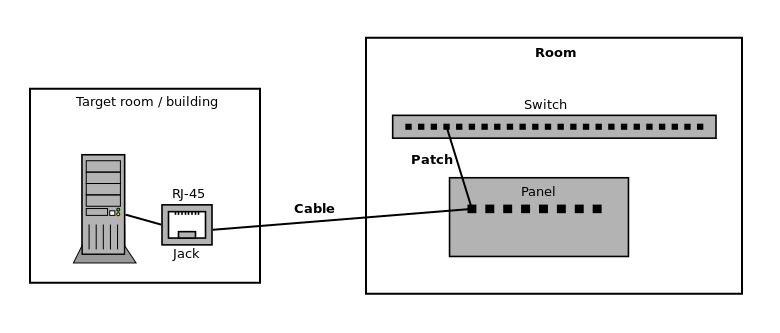

=================
Cabling and Patch
=================

The cabling and patch registry in NAV enables you to document your horizontal
cabling system, to ultimately map which network outlets each switch port is
physically patched through to. This may be useful, for instance, to know which
VLAN a switch port should be configured to use.

.. note:: Another way of doing this is to configure your switch port
          descriptions to contain the label of the ethernet jacks the ports
          are patched through to. This enables you to search for these strings
          in the main NAV search bar.

Concepts
========

*Cabling* is used to register the ethernet cables that run from your wall
outlets to the patch panels in your wiring closets (NAV *Rooms*). The ethernet
jacks on each end of such a cable should be labelled identically. *Patch* is
used to register which switch port each cable is physically connected to.

Cabling
=======

When adding cabling records, you must first choose the NAV *Room* from where
the cable runs. Then you enter the ethernet jack label. It helps to have
descriptive labels on your ethernet jacks.

If you want to, you can add information about where the outlet is located,
such as a building name and office number.

Patch
=====

Patch records describe how a switch port is connected an existing cabling
record. First, you must select a switch you want to add the patch record for.
Based on this, NAV filters out the cabling records that are terminated in the
same room as the switch. When adding a patch to a switch port, it will list
all unpatched cables in that room as patch candidates.

Port Details
============

If a patch is registered on a switch port, the patch and cabling information
will be displayed in that port's *Port details* page, in the *Connection*
table.
