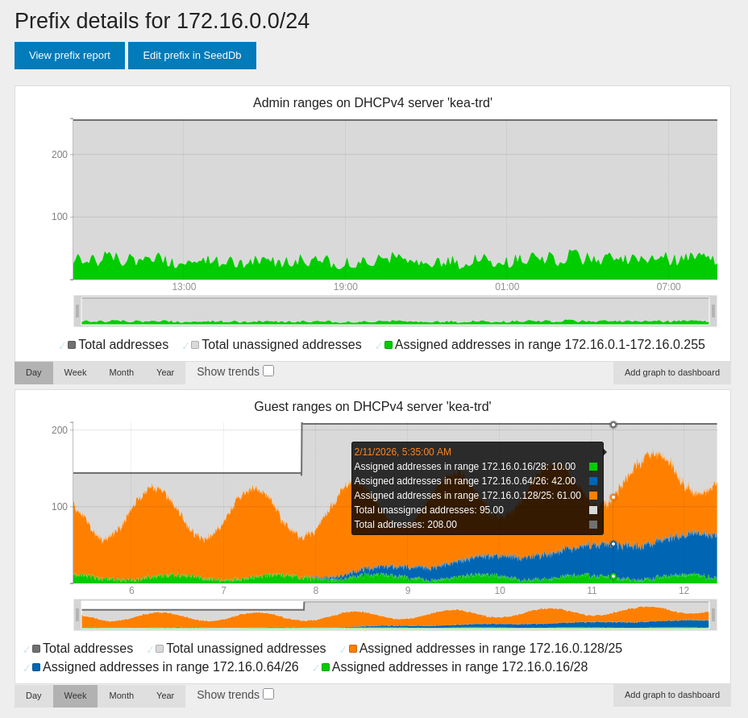

==========
DHCP Stats
==========

Introduction
============

What DHCP servers are supported?
--------------------------------

NAV can request, collect, and display stats from DHCP servers if they expose an
API for fetching stats. Alternatively, if a DHCP server does not expose an API
for fetching stats, a standalone script running on the DHCP server itself can
send stats directly to NAV's Graphite/Carbon timeseries database backend,
alleviating the need for NAV to request and collect stats at the cost of extra
maintenance for the administrator.

NAV currently supports collecting stats from one DHCP server implementations:

:ref:`kea_dhcpv4_servers`
   Configure at minimum a Kea DHCPv4 HTTP/HTTPS control socket, and assign each
   pool in the Kea DHCPv4 configuration unique pool IDs, and NAV can start
   collecting IPv4 stats from each Kea DHCPv4 pool over the control socket.

What DHCP terminology does NAV use?
-----------------------------------
DHCP server implementations seem to use certain DHCP terms in slightly different
ways. To avoid confusion, here's all the DHCP terms that NAV uses.

Subnet
  A subnet.
Pool
  An arbitrary set of IP addresses that a DHCP server can use when allocating IP
  addresseses to a certain class of clients on that subnet.
Range
  The set of all IP addresses that are greater than or equal to some IP address
  and smaller than or equal to some other IP address that a DHCP server can use
  when allocating IP addresseses to a certain class of clients on that subnet.
Server name
  Name of a DHCP server instance, e.g. *kea-dhcp4-oslo*. Due to restrictions in
  the Graphite/Carbon timeseries database, the name should only consist of
  English letters, digits, hyphens, and underscores.
Group name
  Name of a group of either subnets, pools, or ranges configured on a server
  instance that NAV should display together. Due to restrictions in the
  Graphite/Carbon timeseries database, the name should only consist of English
  letters, digits, hyphens, and underscores.

.. note::

   When stats are collected, NAV will translate any terms used by external DHCP
   servers to the corresponding term used in NAV.

   For example, any mention of "pool" in data from a Kea DHCPv4 server will be
   presented in the NAV web UI as "range". Any mention of "range" in in data
   from a ISC DHCP server would have been presented in the NAV web UI as
   "range". Any mention of "pool" in data from a MikroTik RouterOS v7 DHCP
   server would have been presented in the NAV web UI as "pool", etc.

.. note::

   The term *group name* is not really a term used by any DHCP server, but many
   DHCP servers do have a mechanism for grouping together similar subnets,
   pools, and/or ranges under a common name.
   By default, each range/pool/subnet is assigned to its own unique group.

What DHCP stats are collected?
------------------------------
Total addresses (IPv4)
   The total amount of IP addresses controlled by the DHCP server on a per
   range/pool/subnet basis.
Assigned addresses (IPv4)
   The amount of IP addresses that are in use (assigned to clients or used by
   misbehaving clients) on a per range/pool/subnet basis.
Unassigned addresses (IPv4)
   The amount of IP addresses that are not in use (the difference between total
   and assigned addresses) on a per range/pool/subnet basis.
Declined addresses (IPv4)
   The amount of IP addresses that are used by misbehaving clients (and thus not
   available for assignment) on a per range/pool/subnet basis. (This stat is
   currently not used in NAV.)

NAV collects these stats on a per range basis if possible. If that is not
possible, it collects on a per pool basis if possible. If that is not possible
either, it collects stats on a per subnet basis if possible.

Where can I see collected DHCP stats in NAV?
--------------------------------------------

DHCP stats are displayed in two types of pages in the NAV web UI you're probably
already familiar with:

* **VLAN pages**. The stats collected for a group of ranges/pools/subnets are
  displayed on a specific VLAN's page if at least one IP address contained in
  the group also is contained in that VLAN.

* **Prefix pages**. The stats collected for a group of ranges/pools/subnets are
  displayed on a specific Prefix's page if at least one IP address contained in
  the group also is contained in that Prefix.

Below is an example depicting how stats collected for two groups of ranges,
"Guest" and "Admin" on the DHCP server "kea-trd", are displayed on the page for
the prefix ``172.16.0.0/24``. (Note how "Guest" and "Admin" are two separate
private networks occupying the same private address space on the DHCP server;
but since the range ``127.16.0.1-127.16.0.255`` is collected under the group
name "Guest", and the rest of the ranges are collected under the group name
"Admin", the stats from the different private networks are separated correctly
and won't interfere with each other. This separation would also have worked if
the stats came from separate servers, even if they had the same group name. So
you should only worry about stats from different private networks interfering
with each other if all stats come from the same server *and* has the same group
name.)

Configuration
=============

Usually, for each DHCP server you want to collect stats from, both NAV
*and* the DHCP server needs to be configured.

The first subsection below describes how to configure NAV the first time you
start collecting DHCP stats. The following subsections describe how both NAV and
a specific DHCP server implementation's server needs to be configured for NAV to
start collecting stats from that server.

.. _dhcpstats_nav_configuration:

NAV
---

If you :doc:`installed NAV </intro/install>` for the first time at version 5.17
or later you should be good to go. Otherwise, you may need to follow or double
check the steps described in this section.

Updating the Storage Schema
^^^^^^^^^^^^^^^^^^^^^^^^^^^

Before DHCP stats are collected and subsequently sent to NAV's Graphite/Carbon
timeseries database for the first time, the database's storage schema must be
updated to :ref:`avoid graphing problems<graph_gaps_storage_schema>`.

1. If it's not already there, add the following section to the
   Graphite/Carbon *storage-schema* configuration file:

   .. code-block:: ini
     :caption: storage-schemas.conf

     [nav-dhcp]
     pattern = ^(nav|nav-contrib)\.dhcp\.
     retentions = 300s:7d, 30m:12d, 2h:50d, 1d:600d

   The retention periods in the *retentions* option can be adjusted to your
   liking, but the shortest retention period should match the period of the
   :program:`navdhcpstats` cronjob, which NAV configures to be five minutes
   (300s) by default (but see also the next subsection).

2. Make sure :program:`carbon-cache` is restarted.
   (See :ref:`integrating_graphite_with_nav_configuring_graphite`
   if you're lost.)

Updating the Crontab Entry
^^^^^^^^^^^^^^^^^^^^^^^^^^

Next, a cronjob for the program :program:`navdhcpstats` that runs with a period
that matches the *retentions* configured above must be installed.

1. If you set the shortest retention period above to be 300s, this matches the
   period of the default :program:`navdhcpstats` cronjob that ships with NAV. In
   this case, you can try installing the cronjob by running ``nav start
   navdhcpstats``, and if this succeeds, you're done.

2. Otherwise, if you set the shortest retention period above to instead be, say,
   2 minutes (120s), you should save the following snippet in a file called
   :file:`navdhcpstats` in NAV's :file:`etc/cron.d/` directory:

   .. code-block:: console
     :caption: etc/cron.d/navdhcpstats

     */2 * * * * navdhcpstats

   Of course, if it's not 2 minutes either, you should change the cron timespec
   ``*/2 * * * *`` to match whatever you've set.

3. Install the cronjob by running ``nav start navdhcpstats``.

.. _kea_dhcpv4_servers:

Kea DHCPv4 Servers (IPv4)
----------------------------

.. note::

    NAV works with Kea versions 2.4.0 and above. The most recent version known
    to work with NAV is Kea version 3.0.0.

.. note::

   NAV does not require that any hook libraries have been installed into the Kea
   DHCPv4 server (see *Hook Libraries* in `kea.readthedocs.io
   <https://kea.readthedocs.io/en/kea-3.0.1/arm/hooks.html#hook-libraries>`_).
   Kea offers a hook that adds extra API commands which become necessary to use
   if one wants reliable stats when using a setup where multiple Kea servers share
   the same underlying lease database (see *Statistics Commands for
   Supplemental Lease Statistics* in `kea.readthedocs.io
   <https://kea.readthedocs.io/en/kea-3.0.1/arm/hooks.html#libdhcp-stat-cmds-so-statistics-commands-for-supplemental-lease-statistics>`_);
   if you run such a setup, keep in mind that NAV does not make use of this hook,
   so stats may in this case be unreliable. [#f1]_

.. note::
   A pool in Kea is a range in NAV. NAV collects IPv4 stats from Kea DHCPv4
   servers on a per-Kea-pool-basis (or, from NAVs perspective: a
   per-range-basis).

We'll
walk through the steps needed to configure the Kea DHCPv4 server and NAV in
order to start collecting stats. Repeat the steps for each Kea DHCPv4 server
you'd like to collect stats from.

Configuring a Kea DHCPv4 Server
^^^^^^^^^^^^^^^^^^^^^^^^^^^^^^^

.. note::

    Kea versions 2.x.x are configured in a slightly different manner than Kea
    versions 3.x.x. The configuration steps below are described with Kea
    versions 3.x.x in mind; the steps needed for Kea versions 2.x.x should be
    straightforward to infer. Nonetheless, we've included working examples for
    both :ref:`Kea versions 3.x.x <kea_3_x_x_configuration_example>` and
    :ref:`Kea versions 2.x.x <kea_2_x_x_configuration_example>` further below.

1. A control socket that serves the Kea API of the Kea DHCPv4 server needs to be
   set up with a ``socket-type`` of ``http`` or ``https`` and a
   ``socket-address`` plus ``socket-port`` combination reachable either directly
   or through a reverse proxy by NAV (see *Control Socket* in
   `kea.readthedocs.io
   <https://kea.readthedocs.io/en/kea-3.0.1/arm/dhcp4-srv.html#http-https-control-socket>`_).
   NAV needs access to the three Kea API commands `config-get
   <https://kea.readthedocs.io/en/kea-3.0.1/api.html#config-get>`_,
   `config-hash-get
   <https://kea.readthedocs.io/en/kea-3.0.1/api.html#config-hash-get>`_ and
   `statistic-get-all
   <https://kea.readthedocs.io/en/kea-3.0.1/api.html#statistic-get-all>`_. For
   security purposes, consider disabling access to any other API command or at
   least disabling write access over the control socket (as of Kea version
   3.0.0, these security settings only seem to be available
   through the `RBAC premium hook
   <https://kea.readthedocs.io/en/kea-3.0.1/arm/hooks.html#libdhcp-rbac-so-role-based-access-control>`_).
   Also consider enabling client SSL certificate authentication (see either your
   reverse proxy's TLS documentation or *TLS/HTTPS Configuration* in `kea.readthedocs.io
   <https://kea.readthedocs.io/en/kea-3.0.1/arm/security.html#tls-https-configuration>`_).
   As stated above, `config-get
   <https://kea.readthedocs.io/en/kea-3.0.1/api.html#config-get>`_ must be
   available for NAV to use; therefore you should consider whether there's information in
   the Kea configuration (such as user passwords) that are too sensitive to be
   served.

   .. note::

      The `config-get
      <https://kea.readthedocs.io/en/kea-3.0.1/api.html#config-get>`_ API
      command is needed to collect stats from each Kea pool since pool IDs are
      not known beforehand by NAV (and as of the latest Kea version, version
      3.0.0, no fit for purpose API command exist to obtain pool IDs). The
      `network4-list
      <https://kea.readthedocs.io/en/kea-3.0.1/api.html#network4-list>`_ and
      `subnet4-list
      <https://kea.readthedocs.io/en/kea-3.0.1/api.html#subnet4-list>`_ API
      commands (open-sourced in Kea starting with version 3.0.0) could
      alternatively have been used to instead collect stats from each Kea subnet
      if access to the `config-get
      <https://kea.readthedocs.io/en/kea-3.0.1/api.html#config-get>`_ API
      command is disabled by an administrator. Neither defaulting to nor falling
      back to using `network4-list
      <https://kea.readthedocs.io/en/kea-3.0.1/api.html#network4-list>`_ and
      `subnet4-list
      <https://kea.readthedocs.io/en/kea-3.0.1/api.html#subnet4-list>`_ is
      however currently supported by NAV.

2. Each pool in the Kea DHCPv4 configuration **must** be manually assigned a
   unique pool ID (see the note on pool IDs under *Statistics in the DHCPv4
   Server* in `kea.readthedocs.io
   <https://kea.readthedocs.io/en/kea-3.0.1/arm/dhcp4-srv.html#statistics-in-the-dhcpv4-server>`_).

3. Each pool in the Kea DHCPv4 configuration
   **may** be manually assigned a user-context containing the key ``group``
   whose value is the pool's group name consisting of english letters,
   digits, underscores and/or hyphens.

.. _kea_3_x_x_configuration_example:

Kea Version 3.x.x Example
~~~~~~~~~~~~~~~~~~~~~~~~~

A minimal Kea version 3.x.x DHCPv4 configuration may thus look like this (notice the keys
``pool-id`` and ``user-context`` for each pool):

.. code-block:: json
   :caption: /etc/kea/kea-dhcp4.conf

    {
      "Dhcp4": {
        "subnet4": [
          {
            "subnet": "172.31.255.0/24",
            "pools": [
              {
                "pool": "172.31.255.0/26",
                "pool-id": 1,
                "user-context": {
                  "group": "second-floor"
                }
              },
              {
                "pool": "172.31.255.64/26",
                "pool-id": 2,
                "user-context": {
                  "group": "second-floor"
                }
              },
              {
                "pool": "172.31.255.128 - 172.31.255.150",
                "pool-id": 3,
                "user-context": {
                  "group": "first-floor"
                }
              }
            ],
            "id": 1
          }
        ],
        "control-sockets": [
          {
            "socket-type": "https",
            "socket-address": "10.20.30.40",
            "socket-port": 5060,
            "trust-anchor": "/path/to/the/ca-cert.pem",
            "cert-file": "/path/to/the/agent-cert.pem",
            "key-file": "/path/to/the/agent-key.pem",
            "cert-required": true
          }
        ]
      }
    }

.. _kea_2_x_x_configuration_example:

Kea Version 2.x.x Example
~~~~~~~~~~~~~~~~~~~~~~~~~

Control sockets in Kea versions 2.x.x are configured in a slightly different
way, because the handling of HTTP/HTTPS requests is delegated to a separate
program (the *Kea Control Agent*) which is configured separately.

Thus, a minimal Kea DHCPv4 configuration may look like this instead:

.. code-block:: json
   :caption: /etc/kea/kea-dhcp4.conf

    {
      "Dhcp4": {
        "subnet4": [
          {
            "subnet": "172.31.255.0/24",
            "pools": [
              {
                "pool": "172.31.255.0/31",
                "pool-id": 1,
                "user-context": {
                  "group": "second-floor"
                }
              },
              {
                "pool": "172.31.255.64/31",
                "pool-id": 2,
                "user-context": {
                  "group": "second-floor"
                }
              },
              {
                "pool": "172.31.255.128 - 172.31.255.150",
                "pool-id": 3,
                "user-context": {
                  "group": "first-floor"
                }
              }
            ],
            "id": 1
          }
        ],
        "control-socket": {
          "socket-type": "unix",
          "socket-name": "/run/kea/control-socket-4"
        }
      }
    }

...followed by a minimal Kea Control Agent configuration that may look like this:

.. code-block:: json
   :caption: /etc/kea/kea-ctrl-agent.conf

    {
      "Control-agent": {
        "http-host": "10.20.30.40",
        "http-port": 5060,
        "trust-anchor": "/path/to/the/ca-cert.pem",
        "cert-file": "/path/to/the/agent-cert.pem",
        "key-file": "/path/to/the/agent-key.pem",
        "cert-required": true,
        "control-sockets": {
          "dhcp4": {
            "socket-type": "unix",
            "socket-name": "/run/kea/control-socket-4"
          }
        }
      }
    }

Configuring NAV to Recognize a Kea DHCPv4 Server
^^^^^^^^^^^^^^^^^^^^^^^^^^^^^^^^^^^^^^^^^^^^^^^^
Make sure you've done the initial :ref:`(DHCP stats) NAV configuration steps
<dhcpstats_nav_configuration>` first.

1. Decide upon a unique server name consisting of english letters, digits,
   underscores and/or hyphens to give the Kea DHCP server; we'll use the
   arbitrary name ``kea-oslo-office`` in this example.

2. Find the URL of the control socket that serves the Kea API of the Kea DHCPv4
   server (we'll assume the URL is ``https://example.org:5060/`` which,
   following the Kea configuration examples above, should resolve to
   ``https://10.20.30.40:5060/``).

Then, add a new section to the NAV *dhcpstats.conf* file, like so:

.. code-block:: ini
   :caption: /etc/nav/dhcpstats.conf

   [server_kea-oslo-office]
   type=kea-dhcp4
   url=https://example.org:5060/

The above is a minimal working configuration for NAV to start collecting IPv4
stats from the Kea API at ``https://example.org:5060/``. Notice a few things:

* The section name starts with ``server_`` to inform NAV that the section
  configures a server. The part after ``server_`` is ``kea-oslo-office``, which
  becomes the name of the configured server in NAV.
* The ``type=kea-dhcp4`` option informs NAV that this section configures a Kea
  DHCPv4 server. This option must be included in all sections that configure Kea
  DHCPv4 servers.
* The ``url=...`` value must be a URL with HTTP or HTTPS as scheme.

Some additional options can be given depending on your specific setup. Here's a fully
configured Kea DHCPv4 server section:

.. code-block:: ini
   :caption: /etc/nav/dhcpstats.conf

   [server_kea-oslo-office]
   type=kea-dhcp4
   url=https://example.org:5060/
   timeout=5.0
   http_basic_username=nav
   http_basic_password=cfcc3475c4de4f0484a4a475ec0a6edd
   client_cert_path=/etc/client-cert.pem
   client_cert_key_path=/etc/client-cert-key.pem
   user_context_groupname_key=group-name

* Set the ``timeout`` option to specify how many seconds NAV should wait for an
  HTTP response from the Kea API before timing out (NAV defaults to
  5.0s).

* Set the ``http_basic_username`` and ``http_basic_password`` options to specify
  that NAV should authenticate to the API using HTTP Basic Authentication
  with the given username and password.

* Set the ``client_cert_path`` and ``client_cert_key_path`` options to specify
  that NAV should authenticate to the API using client-side SSL certificates.
  ``client_cert_path`` specifies the path to a file containing the client's
  certificate. ``client_cert_key_path`` specifies the path to a file containing
  the client's private key. You can optionally omit ``client_cert_key_path`` and
  only specify ``client_cert_path``; in this case, it is assumed that
  ``client_cert_path`` specifies the path to a file containing both the client's
  certificate and its private key.

* Set the ``user_context_groupname_key`` to specify what key inside the
  ``user-context`` objects of the Kea DHCPv4 configuration NAV should use to look
  up the group name for each Kea pool (NAV defaults to the key ``group`` when
  looking up the group name of a Kea pool).

.. note::

   There's currently no option to manually specify root certificates that NAV
   should trust when verifying the identity of HTTPS servers; NAV uses Mozilla's
   list of root certificates as provided by the ``certify`` Python package.

-----

.. [#f1] The two main reasons that NAV doesn't make use of this hook is that it
         is not loaded into Kea by default, and that the stats that it provides
         are more coarse-grained (stats are per subnet) than those provided
         through standard API commands used by NAV (where stats are per Kea
         pool).
