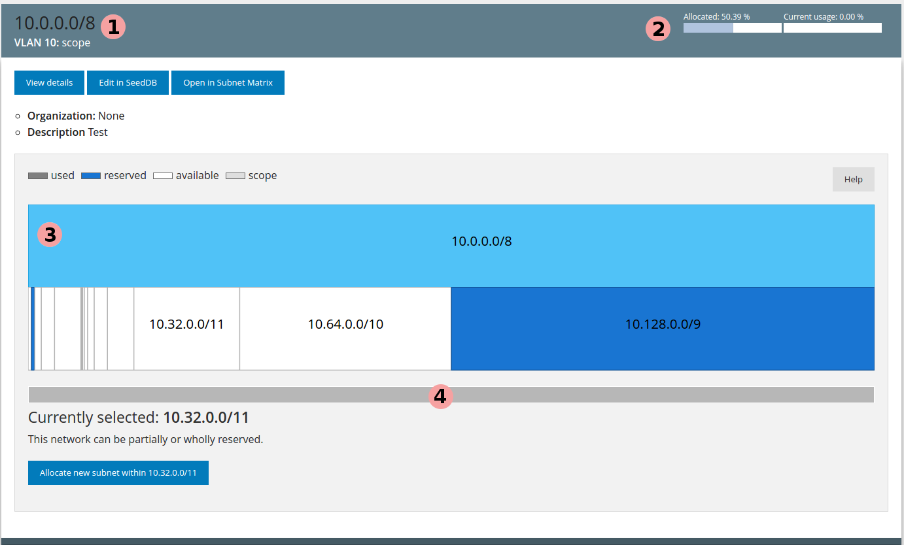
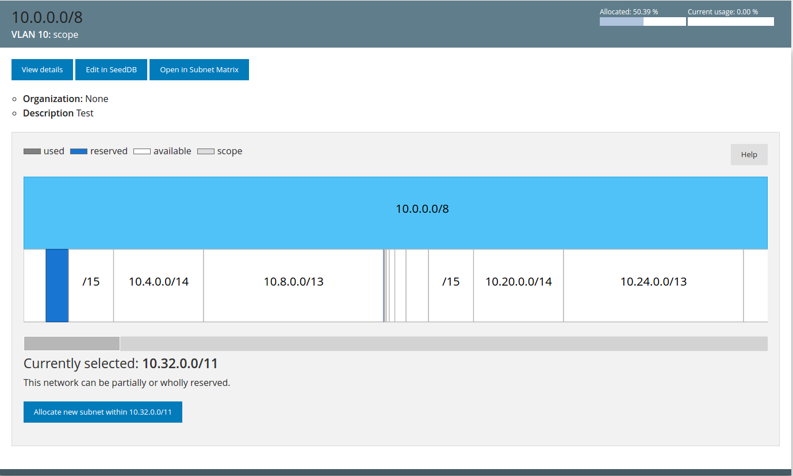
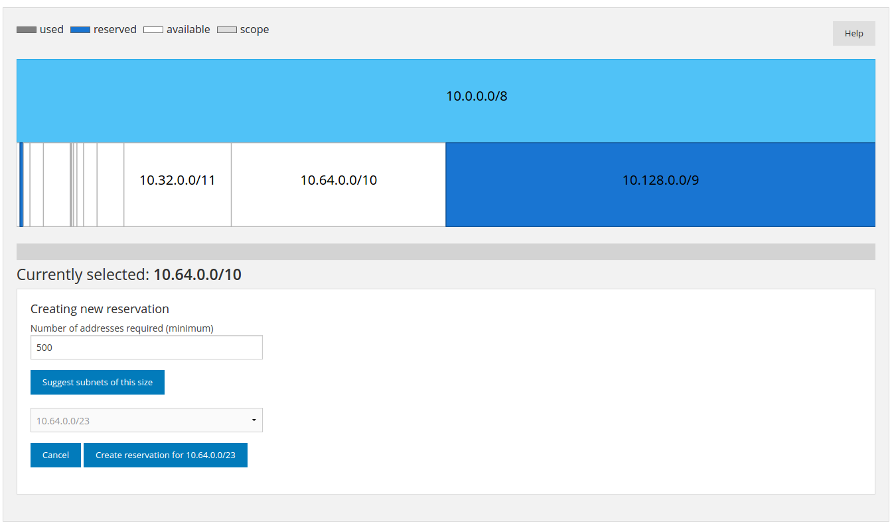

============================
IPAM - IP Address Management
============================

Introduction
============

IPAM is a tool to make network planning and management more pleasant. It does so
by constructing a visual representation of how the address space is used, and
also allows for easy filtering and discovery of prefixes.

What can IPAM do?
=================

Currently you are able to

* filter prefixes according to criteria like the net type, VLAN number and what
  organization owns the prefix
* order prefixes by VLAN, prefix, usage (active clients as percentage of the
  total number of addressable hosts) and how much of the prefix is allocated
* view the different prefixes found within a registered prefix (scope) and what
  areas of the address space are (or are not) in use
* request and reserve prefixes of a certain size within a scope, given that the
  address space is unused (:ref:`reserving_prefixes`).

Exploring your network
======================

.. image:: ipam-main-ui.png

1. The search form. Here you can construct a query to only show the prefixes you
   want to see.

2. A node within the IPAM, in this case the prefix "10.0.0.0/8"

The prefix user interface
-------------------------

1. General information about the prefix, like the net ident and its associated
   VLAN number.
2. Statistics about this prefix. Note that usage is related to the current
   number of active hosts, whereas allocation is based on the percentage of the
   total address space used by "sub-prefixes" within this prefix.
3. Overview of the address space (the "subnet map"). This shows you how the
   address space of the prefix is used, and can be used to easily discover
   available ranges. You can select nodes by clicking on them.
4. Sliding rule to easily view only parts of the prefix. This is useful for
   viewing very large prefixes with small allocations, and complements the zoom
   functionality built into the IPAM.

Zooming
-------

           
You can zoom into the subnet map by clicking on the slider and selecting the
area you want to focus on (the dark grey area in the slider above). You can also
zoom by double-clicking or by using your scroll wheel.

.. _reserving_prefixes:

How to reserve prefixes
=======================

* Find a suitable, available (white) range that you would like to reserve
  within. Select the range by clicking on it.
* Enter the desired minimum size of the reservation (number of hosts). You can
  now select the appropriate range from a dropdown-menu.
* After selecting the desired range, click "Create reservation" to open a a
  pre-filled form in SeedDB, where the actual registration is done.

Workflows
---------

I want to see all the networks within VLAN 20
~~~~~~~~~~~~~~~~~~~~~~~~~~~~~~~~~~~~~~~~~~~~~

Enter "20" into the VLAN field in the form to the left. Click "Search". Voila,
you're done.
