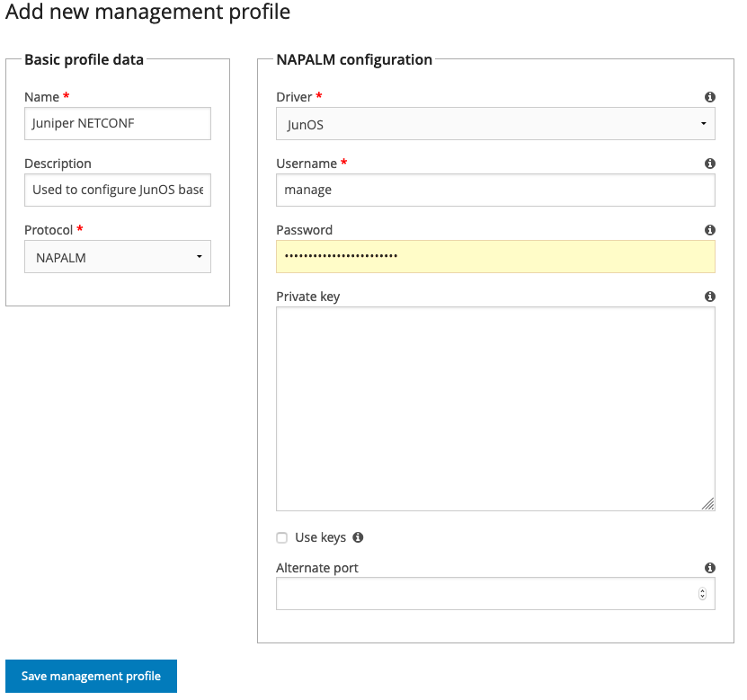
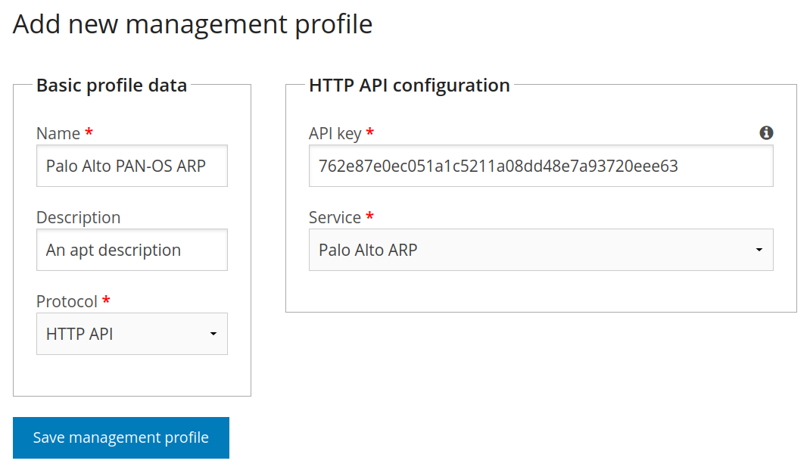

===================
Management profiles
===================

Introduction
============

Management profiles are how to configure NAV with the necessary credentials and
options to manage networked devices. You may require multiple management
profiles to manage all your devices.  They are created and edited in the
"management profile" tab in the SeedDB tool, available from the Toolbox.

The simplest scenario is the one where all your network devices support SNMP,
using the same community, and you only need to fetch data, not send
configuration changes, from NAV. In this case, you need only a single
management profile, to define the SNMP community used on your devices, and then
you will assign this profile to all your devices in the SeedDB tool.

An IP device can be assigned multiple profiles as well. A common scenario for
this is a device you wish to make configuration changes on, either through
:doc:`PortAdmin </reference/portadmin>` or :doc:`Arnold
</reference/arnold>`. Typically, you will create one management profile with
the read-only SNMP community, which NAV will use for all operations where it
only needs read access to the devices. You will need to create a second
management profile containing an SNMP community that will give PortAdmin write
access to the switch, and the ``Write`` checkbox will need to be checked on
this profile.

Supported profile types
=======================

Traditionally, NAV only supported SNMP, but as of NAV 5.1, this changed.

SNMP
----

NAV currently supports SNMP versions **1** and **2c**, which can be selected
from the :guilabel:`Version` dropdown in the management profile form.

.. image:: /intro/seeddb-add-profile.png

Checking the :guilabel:`Write` checkbox will tell NAV that the community
configured in this profile will provide NAV with write access to the devices it
is assigned to.

Otherwise, the procedure for creating an SNMP profile is documented in the
:doc:`Getting started guide </intro/getting-started>`.

NAPALM
------

NAV can use the NAPALM_ library to manage some devices, using NETCONF_ or other
underlying protocols. As of NAV 5.1, these profiles are only used to configure
*Juniper* switches in :doc:`PortAdmin </reference/portadmin>`, as Juniper does
not support SNMP write operations for modifying device configuration.

Adding a NAPALM profile looks like this:

These fields can be configured:

Driver
  The NAPALM "driver" to use for communication. This is usually vendor
  specific. Currently, only the JunOS driver can be selected, since Juniper is
  the only platform NAV needs NAPALM on.

Username
  Which username to access the switch with. The JunOS driver uses SSH, so this
  would be an SSH user that can run netconf commands on the switch.

Password
  The SSH password for this user.

Private key
  An SSH private key that will give SSH access as the configured user. If
  filled out, the password is assumed to be the passphrase to unlock the key
  itself. Leave ``password`` empty if the key doesn't have one.

Use keys
  If checked, the JunOS driver will use the SSH keys available in the file
  system of the NAV web server for authentication. This usually means that the
  keys must be present in the home directory of the user running the NAV Django
  application, in :file:`~/.ssh/`.

Alternate port
  If access to the switch is not on the default port (22, in the case of the
  JunOS driver), put the alternate port here.

.. _`NAPALM`: https://napalm.readthedocs.io/en/latest/
.. _`NETCONF`: https://en.wikipedia.org/wiki/NETCONF

.. _http-rest-api-management-profile:
HTTP APIs
--------------
As of NAV 5.12, HTTP API profiles are used to configure access to
services of the following devices.

`Palo Alto PAN-OS firewalls`_
  A HTTP API profile is needed for NAV to access the firewall's ARP information.

.. warning:: The Palo Alto ARP implementation in NAV does not currently verify TLS
             certificates when accessing a Palo Alto API.  This will be changed
             at a later date, but if it worries you, you should not configure
             any netboxes to use the Palo Alto Arp service yet.

If you have a Palo Alto PAN-OS firewall running on a netbox managed by NAV,
with a secret API key of ``762e87e0ec051a1c5211a08dd48e7a93720eee63``,
you can configure NAV to fetch ARP information from this firewall by
creating a new management profile with

* Protocol set to ``HTTP API``,

* API key set to ``762e87e0ec051a1c5211a08dd48e7a93720eee63``,

* Service set to ``Palo Alto ARP``,

and then add this management profile to the netbox.

.. _`Palo Alto PAN-OS firewalls`: https://docs.paloaltonetworks.com/pan-os/11-0/pan-os-panorama-api/pan-os-xml-api-request-types/configuration-api/get-active-configuration/use-xpath-to-get-arp-information
