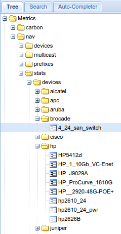

========
navstats
========

*navstats* makes it possible to retrieve any data from the database and send it
to Graphite so that it can be used in graphs and reports in NAV and other tools
with access to the Graphite web-api.

Introduction
============

*navstats* was originally to be called *Management statistics* and was meant to
cover the need for having relevant statistics regarding your network to show to
your boss or management. However, finding a common ground for what the
management wanted to see turned out to be impossible, and the fleeting and not
very well formulated demands meant that nothing concrete was going to be made
ever.

This lead to a fundamental shift in the proposal. What was implemented was a way
to enable NAV administrators to write SQL-statements that produced the
statistics they wanted and periodically send it to Carbon. Thus the NAV
administrator himself decides what data is important, and the Graphite web-api
enables him to extract data as he wishes - either as a graph directly in NAV or
to other external tools.

The original request and final proposal is available on `Launchpad
<https://bugs.launchpad.net/nav/+bug/1321249>`_ and
`GitHub <https://github.com/Uninett/nav/issues/1187>`_.

Usage
=====

There are three steps for starting out with *navstats*:

#. *navstats* requires that you either know the structure of the NAV database
   very well or is able to formulate your requirement to someone that does, for
   instance using one of the `support-channels
   <https://nav.uninett.no/#footer>`_. The reason for this is that you need an
   SQL statement that produces the number(s) you are looking for.

#. You need to know what a `metric path
   <http://graphite.readthedocs.io/en/latest/feeding-carbon.html#getting-your-data-into-graphite>`_ is in
   Graphite, and how it is relevant for storing data. Basically, you need to
   choose the naming scheme for *your* data. All NAV-data starts with **nav.**,
   so your data should probably have another prefix.

#. Read the *navstats.conf*-file and fill in what you gathered in step 1
   and 2. Make sure the *navstats*-process is not running before editing the
   config-file by running the command ``nav stop navstats``

Example
=======

We use the example from the config-file that continuously counts the different
types of equipment in the database.

SQL
---

::
   
   SELECT vendorid, typename, count(*)
   FROM netbox JOIN type USING(typeid)
   GROUP BY typename, vendorid;

The query will produce lines like this::
  
  vendorid |        typename         | count 
  ----------+-------------------------+-------
  brocade  | 4/24_san_switch         |     1
  hp       | hp2610_24               |     2
  hp       | hp2610_24_pwr           |     1

Namespace
---------

We choose to put all data in the namespace **nav.stats**.

Resulting config
----------------

::

   [netbox_types]
   path=nav.stats.devices.{}.{}
   query=select vendorid, typename, count(*)
       from netbox join type using(typeid)
       group by typename, vendorid;

Thus the path for the values above will be::

  nav.stats.devices.brocade.4/24_san_switch
  nav.stats.devices.hp.hp2610_24
  nav.stats.devices.hp.hp2610_24_pwr

(The script will do some modifications to the path to make sure Graphite can
handle them.)

Result
------

The script (the one that is started as a cron-job when you write ``nav start
navstats``) will make sure to run the SQL and send the output to Graphite.

The result will be browsable in Graphite like shown below. You can use
Graphite's powerful `web-api
<http://graphite-api.readthedocs.io/en/latest/api.html>`_ to access the data in
the format you wish.

