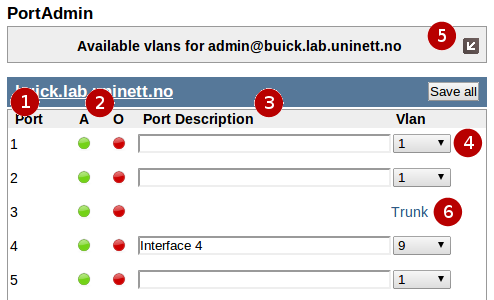
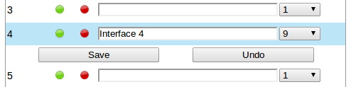
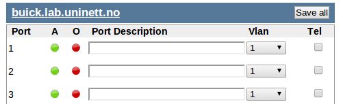

=========
PortAdmin
=========

Introduction
============

PortAdmin is a tool for configuring your switch ports by the help of a web
interface. It does so by communicating with a network device over SNMP [#f1]_.

What can PortAdmin do?
======================

Currently you can

* change a port's description
* change a port's access VLAN
* toggle a port between trunk and access mode
* when an interface is a trunk, you can change which VLANs are tagged on the
  trunk.
* configure a voice VLAN on an interface (:ref:`more_about_voice_vlan`)

What the interface tells you
============================

1. Port is the interface name given by the vendor. This is not possible to
   change
2. These indicators tells you the status of the interface:

  * *Enabled* indicates if the interface is enabled (green) or disabled (red)
  * *Linked* indicates if the interface has link (green) or not (red)

3. Port Description is the ifAlias. This is editable by the user. This is what
   you set by the *name* command on HP and *description* command on Cisco
   devices.
4. Vlan is the current active access VLAN on the interface. You can change
   this by using the dropdown menu. To set this interface to trunking mode,
   select the trunk option from the drop-down.
5. This interface is a trunk. To enter trunk edit mode, click the link.

How to use the interface
========================

Whenever you alter the values on an interface, the color of the row will
change. The save button will turn blue to indicate that you can use it to save
the changes.

When saving the changes a popup box will tell you what PortAdmin is doing and if
everything went well. As this process is best left uninterrupted, the button for
closing this popup will not display until everything is done.

Workflows
---------

I want to change the port description
~~~~~~~~~~~~~~~~~~~~~~~~~~~~~~~~~~~~~

Start writing in the text field. The row and save button should change
color. Click save to save the changes.

I want to change the VLAN
~~~~~~~~~~~~~~~~~~~~~~~~~

Choose VLAN from the VLAN dropdown and click "Save". PortAdmin will disable the
interface for a few seconds and then enable it again. This is done to indicate
to any client connected to the interface that it should try to get a new
IP-address.

I want to edit a trunk
~~~~~~~~~~~~~~~~~~~~~~

Click the "Trunk" link. It will take you to the edit trunk interface. Make
your changes and click "Save changes".

I want to set an interface to trunking mode
~~~~~~~~~~~~~~~~~~~~~~~~~~~~~~~~~~~~~~~~~~~

Click the VLAN dropdown and choose the "Trunk" option. The edit trunk
interface should appear. Set the native VLAN and the tagged VLANs. Click
"Save changes".

I want to set an interface to access mode
~~~~~~~~~~~~~~~~~~~~~~~~~~~~~~~~~~~~~~~~~

Click the trunk link to edit the trunk. Remove all trunk VLANs. Set the
native VLAN to what you want the access VLAN to be. Click "Save changes".

I want to save all changes without clicking all the save buttons
~~~~~~~~~~~~~~~~~~~~~~~~~~~~~~~~~~~~~~~~~~~~~~~~~~~~~~~~~~~~~~~~

Click one of the "Save all" buttons.

I want to activate the voice VLAN on an interface
~~~~~~~~~~~~~~~~~~~~~~~~~~~~~~~~~~~~~~~~~~~~~~~~~

If no column for activating voice VLANs appear,
no voice VLANs are configured in PortAdmins config file. This must be done
by a NAV administrator.

To activate the voice VLAN, click the checkbox and click "Save".

I cannot edit an interface
~~~~~~~~~~~~~~~~~~~~~~~~~~

Two things can lead to an interface not being editable (no fields or dropdowns appear):

* The NAV admin has turned on VLAN authorization. This means you can only
  edit interfaces that have a VLAN that you are organizationally connected to.
* Something called a *read-write community* has not been set on the device. The
  *read-write community* is similar to a password, and is needed for PortAdmin
  to be able to give commands to the device. To fix this, a NAV admin must
  edit the device in SeedDB and assign a write-enabled SNMP management profile
  to it there. Also, the device itself must be configured to accept SNMP write
  requests.

Some parts of the interface is disabled/greyed out
~~~~~~~~~~~~~~~~~~~~~~~~~~~~~~~~~~~~~~~~~~~~~~~~~~

See above.

The Config File
===============

PortAdmin has a config file. Some of the options that can be set in this file
are:

**voice_vlans**
    Voice VLANs are the VLANs you use for IP telephone traffic. If
    you define several VLANs here, make sure only one of them is
    available on the netbox. Otherwise there is no way of knowing
    which one you want. If this option is set, the interface will
    display a checkbox to enable and disable voice VLAN on the
    interface. :ref:`more_about_voice_vlan`

**cisco_voice_vlan**
    Cisco has its own terminology and configuration regarding voice VLANs. NAV
    also supports this. To make NAV use Cisco Voice VLANs, set this option to
    ``true``. The default is ``false``.

**cisco_voice_cdp**
    If using Cisco Voice VLANs, set this option to ``true`` to explicitly
    enable CDP on a port when its voice vlan is configured (and consequently,
    disable CDP when voice vlan is de-configured). The default is ``false``.

**vlan_auth**
    If you want to limit what users can do in PortAdmin you activate
    this option. What this does is limit the choice of VLANs to the
    ones connected to the users organization.

**vlan and netident**
    Some network admins want to use a separate VLAN to indicate that
    this interface does not route traffic. Use these options to define
    that VLAN.  The VLAN will be available for configuration for all
    users.

**format**
    Experimental feature. Makes you enforce a specific input format on
    the port description.

.. _more_about_voice_vlan:

More about voice VLANs
======================

.. warning::
   The term *voice VLAN* has two meanings in PortAdmin.

Originally, what we meant by "*voice VLAN*" was a VLAN you, as a network admin, had
defined as *the VLAN we use for voice traffic*. It was not related to the Cisco
or HP voice commands.

However, since then, PortAdmin has been extended to also support Cisco Voice
VLANs. This is not the default behavior, but can be enabled in the config file. To
enable this, you have to define voice VLANs in the ``voice_vlans`` directive, and tell
PortAdmin to use Cisco commands by enabling the ``cisco_voice_vlan`` directive.

.. rubric:: Footnotes

.. [#f1] Simple Network Management Protocol
