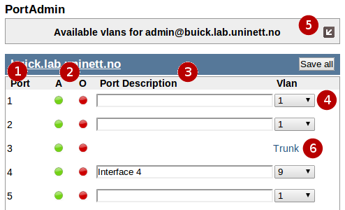
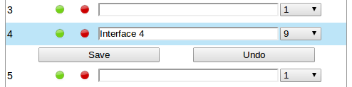
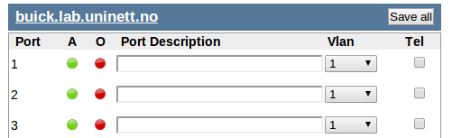

=========
PortAdmin
=========

Introduction
============

PortAdmin is a tool for simple switch port configuration via NAV's web user
interface. It is useful both to do simple switch port adjustments without using
the switch CLI, but also for delegating simple switch port management to NAV
users that do not have full CLI access to a switch.

Configuring a switch from PortAdmin requires the switch to be configured with
either an SNMP [#f1]_ write-enabled management profile in SeedDB, or an
appropriate NAPALM profile for devices that do not support SNMP write
operations.

What can PortAdmin do?
======================

Currently, PortAdmin supports these operations:

* Changing a port's description
* Changing a port's access VLAN
* Toggling a port between trunk and access mode
  * Configure tagged and untagged/native VLANs on ports in trunk mode
* Configure a Voice VLAN on a port (:ref:`more_about_voice_vlan`)
* When a switch port is detected to have 802.1X authentication enabled,
  optionally display a custom hyperlink instead of the VLAN configuration
  dropdown (:ref:`portadmin_dot1x`).

What the interface tells you
============================

1. Port is the interface name given by the vendor. This is not possible to
   change
2. These indicators tells you the status of the interface:

  * *Enabled* indicates if the interface is enabled (green) or disabled (red)
  * *Linked* indicates if the interface has link (green) or not (red)

3. Port Description is the ifAlias. This is editable by the user. This is what
   you set by the *name* command on HP and *description* command on Cisco
   devices.
4. Vlan is the current active access VLAN on the interface. You can change
   this by using the dropdown menu. To set this interface to trunking mode,
   select the trunk option from the drop-down.
5. This interface is a trunk. To enter trunk edit mode, click the link.

How to use the interface
========================

Whenever you alter the values on an interface, the color of the row will
change. The save button will turn blue to indicate that you can use it to save
the changes.

When saving the changes a popup box will tell you what PortAdmin is doing and if
everything went well. As this process is best left uninterrupted, the button for
closing this popup will not display until everything is done.

Workflows
---------

I want to change the port description
~~~~~~~~~~~~~~~~~~~~~~~~~~~~~~~~~~~~~

Start writing in the text field. The row and save button should change
color. Click save to save the changes.

I want to change the VLAN
~~~~~~~~~~~~~~~~~~~~~~~~~

Choose VLAN from the VLAN dropdown and click "Save". PortAdmin will disable the
interface for a few seconds and then enable it again. This is done to indicate
to any client connected to the interface that it should try to get a new
IP-address.

I want to edit a trunk
~~~~~~~~~~~~~~~~~~~~~~

Click the "Trunk" link. It will take you to the edit trunk interface. Make
your changes and click "Save changes".

I want to set an interface to trunking mode
~~~~~~~~~~~~~~~~~~~~~~~~~~~~~~~~~~~~~~~~~~~

Click the VLAN dropdown and choose the "Trunk" option. The edit trunk
interface should appear. Set the native VLAN and the tagged VLANs. Click
"Save changes".

I want to set an interface to access mode
~~~~~~~~~~~~~~~~~~~~~~~~~~~~~~~~~~~~~~~~~

Click the trunk link to edit the trunk. Remove all trunk VLANs. Set the
native VLAN to what you want the access VLAN to be. Click "Save changes".

I want to save all changes without clicking all the save buttons
~~~~~~~~~~~~~~~~~~~~~~~~~~~~~~~~~~~~~~~~~~~~~~~~~~~~~~~~~~~~~~~~

Click one of the "Save all" buttons.

I want to activate the voice VLAN on an interface
~~~~~~~~~~~~~~~~~~~~~~~~~~~~~~~~~~~~~~~~~~~~~~~~~

If no column for activating voice VLANs appear,
no voice VLANs are configured in PortAdmins config file. This must be done
by a NAV administrator.

To activate the voice VLAN, click the checkbox and click "Save".

I cannot edit an interface
~~~~~~~~~~~~~~~~~~~~~~~~~~

Several things can lead to an interface not being editable (no fields or dropdowns appear):

* Your user group has not been granted the PortAdmin privilege for the attribute
  you are trying to change on this device. A NAV administrator must grant it, see
  :ref:`portadmin-privileges`.
* The NAV admin has turned on VLAN authorization. This means you can only
  edit interfaces that have a VLAN that you are organizationally connected to.
* Something called a *read-write community* has not been set on the device. The
  *read-write community* is similar to a password, and is needed for PortAdmin
  to be able to give commands to the device. To fix this, a NAV admin must
  edit the device in SeedDB and assign a write-enabled SNMP management profile
  to it there. Also, the device itself must be configured to accept SNMP write
  requests.

Some parts of the interface is disabled/greyed out
~~~~~~~~~~~~~~~~~~~~~~~~~~~~~~~~~~~~~~~~~~~~~~~~~~

See above.

.. _portadmin-privileges:

Authorizing changes
===================

PortAdmin has two independent layers of authorization:

1. **Which interfaces** a user may edit at all. This is governed by the
   ``vlan_auth`` config option described below, based on the relationship between
   the user's organizations and the VLAN of the interface.
2. **What the user may change** on those interfaces. This is governed by the
   per-attribute privileges described here.

The second layer is off by default. Set ``require_privileges`` to ``on`` in the
``[authorization]`` section of :file:`portadmin.conf` to enforce it. While it is
off, any user allowed to edit an interface may change every attribute on it.

Each editable interface attribute has its own privilege:

==============================  ==========================================
Privilege                       Permits changing
==============================  ==========================================
``portadmin_description``       The port description (ifalias)
``portadmin_vlan``              The access/native VLAN of a port
``portadmin_admin_status``      Enabling and disabling a port
``portadmin_poe``               The PoE state of a port
``portadmin_voice_vlan``        The voice VLAN setting of a port
``portadmin_trunk``             Trunk configuration
==============================  ==========================================

.. important:: Once ``require_privileges`` is on, the default is to deny. A user who
   is not a NAV administrator cannot change anything in PortAdmin until at least one
   of these privileges has been granted to one of their user groups. NAV
   administrators always have full access.

Privileges are granted per user group in the Useradmin tool, under
:guilabel:`Groups`. Each grant has a *target* that scopes it to a set of IP
devices. The target is a regular expression, matched against the names of the
*device groups* defined in SeedDB, in the same way the targets of ``web_access``
privileges are regular expressions. The privilege applies to an IP device if the
expression matches at least one of the device groups it belongs to:

``^SDN$``
    The privilege applies only to IP devices in the device group ``SDN``.

``^LEGACY-.*``
    The privilege applies to IP devices in any device group whose name starts with
    ``LEGACY-``.

``.*``
    The privilege applies to every IP device that is in a device group.

Remember to anchor a target with ``^`` and ``$`` when you mean an exact group name.
An unanchored target such as ``SDN`` also matches a group named ``SDN-EDGE``.

.. note:: Since a target only ever matches device group names, an IP device that
   belongs to no device group at all is matched by no target, not even ``.*``. Put
   an IP device in at least one device group before granting anyone access to it.

The Config File
===============

PortAdmin's operational aspects can be modified through the configuration file
:file:`portadmin.conf`. All available configuration options are documented in
the example config file. Some of the options that can be set in this file are:

**voice_vlans**
    Voice VLANs are the VLANs you use for IP telephone traffic. If
    you define several VLANs here, make sure only one of them is
    available on the netbox. Otherwise there is no way of knowing
    which one you want. If this option is set, the interface will
    display a checkbox to enable and disable voice VLAN on the
    interface. :ref:`more_about_voice_vlan`

**cisco_voice_vlan**
    Cisco has its own terminology and configuration regarding voice VLANs. NAV
    also supports this. To make NAV use Cisco Voice VLANs, set this option to
    ``true``. The default is ``false``.

**cisco_voice_cdp**
    If using Cisco Voice VLANs, set this option to ``true`` to explicitly
    enable CDP on a port when its voice vlan is configured (and consequently,
    disable CDP when voice vlan is de-configured). The default is ``false``.

**trunk_edit**
    When set to ``false``, editing the configuration of trunk ports is
    disabled. The default value is ``true``.

**link_edit**
    When set to ``false``, editing the configuration of any port that has been
    found to be an uplink or downlink is disabled. This could be useful to
    prevent accidental misconfigurations that can cause a switch to become
    non-reachable. The default value is ``true``.

**vlan_auth**
    If you want to limit what users can do in PortAdmin you activate
    this option. What this does is limit the choice of VLANs to the
    ones connected to the users organization.

**require_privileges**
    When set to ``true``, each interface attribute can only be changed by users
    whose group has been granted the corresponding PortAdmin privilege. The default
    is ``false``, which lets any user who may edit an interface change every
    attribute on it. See :ref:`portadmin-privileges`.

**vlan and netident**
    Some network admins want to use a separate VLAN to indicate that
    this interface does not route traffic. Use these options to define
    that VLAN.  The VLAN will be available for configuration for all
    users.

**format**
    Experimental feature. Makes you enforce a specific input format on
    the port description.

.. _portadmin_dot1x:

The ``[dot1x]`` section
-----------------------

PortAdmin cannot (yet) enable or change 801.2X configuration options for switch
ports, but for several vendors, it is able to *detect* whether a port is
operating in 802.1X mode already.

The ``[dot1x]`` section of the configuration file will enable you to customize
hyperlinks to external systems for each 802.1X-enabled port.

A typical usage may be that you have a 3rd party web based system that allows
for you to control 802.1x options, and you want PortAdmin to display a "Dot1x"
button that hyperlinks to that system for each 802.1x-enabled switch port.

The options in this section are:

**enabled**
    When set to ``true``, enables 802.1x detection and hyper link
    customization. Default value is ``false``.

**port_url_template**
    A URL template string, used to build a hyperlink to a potential 3rd party
    system. Into this template is fed a ``Netbox`` (IP Device) object and an
    ``Interface`` object that describes the device and network interface
    represented by a line in the port list.

    An example template could be::

        https://netadmin.example.org/dot1x?switch={netbox.sysname}&ifindex={interface.ifindex}

    This builds a URL to an external system at ``netadmin.example.org``, using
    the values of the ``sysname`` attribute of the netbox/IP device and the
    SNMP ``ifindex`` value of the interface.

    For more details on which attributes are available, see the reference docs
    for :py:class:`nav.models.manage.Netbox` and
    :py:class:`nav.models.manage.Interface`.

.. _more_about_voice_vlan:

More about voice VLANs
======================

.. warning::
   The term *voice VLAN* has two meanings in PortAdmin.

Originally, what we meant by "*voice VLAN*" was a VLAN you, as a network admin, had
defined as *the VLAN we use for voice traffic*. It was not related to the Cisco
or HP voice commands.

However, since then, PortAdmin has been extended to also support Cisco Voice
VLANs. This is not the default behavior, but can be enabled in the config file. To
enable this, you have to define voice VLANs in the ``voice_vlans`` directive, and tell
PortAdmin to use Cisco commands by enabling the ``cisco_voice_vlan`` directive.

.. rubric:: Footnotes

.. [#f1] Simple Network Management Protocol
